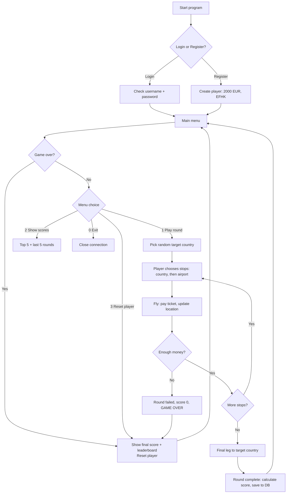
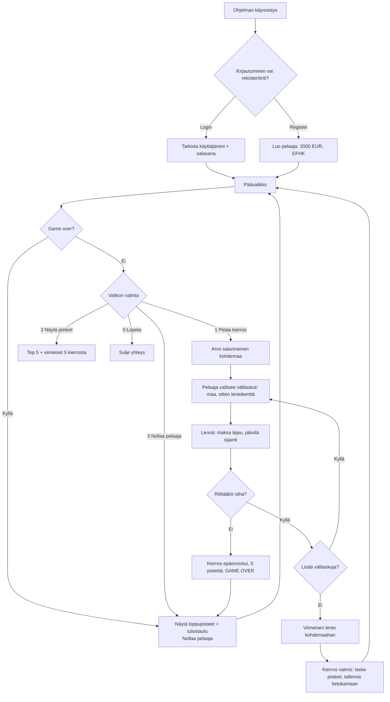

# projekti_metropolia
#  Flight Game / Lentopeli

**🇬🇧 [English](#-english) | 🇫🇮 [Suomi](#-suomeksi) | [Credits / Tekijät](#-credits--tekijät)**

---

# 🇬🇧 English

A text-based Python game where you travel between countries on a limited budget. Each round you get a random target country, and you must fly through a number of stops to reach it, without running out of money.

Built with **Python**, **MySQL** and **geopy**.

## 1. Game Idea in One Minute

1. Register or log in.
2. You start in **Helsinki (EFHK), Finland** with **2000 EUR**.
3. The game picks a **random target country**.
4. You must make a number of **stops** (countries you choose) and then fly to the target.
5. Every flight costs money based on distance (**0.10 EUR per km**).
6. Reach the target → earn **points**. Run out of money → **game over** and a new game starts.

## 2. Game Flow



## 3. Game Rules

| Rule | Value |
|------|-------|
| Starting money | 2000 EUR |
| Starting location | Helsinki-Vantaa (EFHK), Finland |
| Ticket price | Distance in km × 0.10 EUR |
| Stops per round | 1 + number of rounds completed since the last reset |
| Base points for reaching the target | 100 |
| Bonus per stop | 5 points |
| Bonus for money left | 1 point per 100 EUR |
| Failed round | 0 points |

**Score formula**

```
score = 100 + (5 × stops) + (money_left // 100)
```

**Difficulty grows:** the more rounds you win, the more stops are required. Round 1 needs 1 stop, round 2 needs 2 stops, and so on. A reset puts you back to 1 stop.

**Game over happens when:**
- Your money is 0 or less, or
- You can't afford even the cheapest flight to another country, or
- You can't afford any flight to the chosen target country, or
- You run out of money in the middle of a round.

## 4. Project Structure

```
flight-game/
├── main12.py       # Game logic and main loop
└── tietokanta.py   # Database connection, players table, login/register
```

### `tietokanta.py` (database layer)
| Function | Purpose |
|----------|---------|
| `connection` | MySQL connection to the `flight_game` database |
| `START_MONEY` | Single place for starting money (2000 EUR) |
| `ensure_scores_table()` | Creates the `scores` table if it doesn't exist |
| `register()` | Creates a new player |
| `login()` | Checks username and password, returns player row |
| `show_player(player_id)` | Prints player info (name, money, points, airport, country) |
| `gamer_location(player_id)` | Returns the player's current airport code |

### `main12.py` (game logic)
| Function | Purpose |
|----------|---------|
| `play_round()` | Runs one full round: target, stops, final leg |
| `rand_choice()` | Picks a random target country (different from the current one) |
| `choose_airport()` | Lists airports of a country and asks the player to pick one |
| `airport_list()` | Gets large airports of a country (falls back to small airports) |
| `ticket_price()` | Calculates distance with `geopy` and price at 0.10 EUR/km |
| `fly()` | Charges the ticket and moves the player in the database |
| `cheapest_ticket()` | Cheapest possible flight to another country (for game over check) |
| `cheapest_to_country()` | Cheapest flight to the chosen target country |
| `game_over()` | Checks if the player can still travel |
| `calc_score()` | Calculates the round score |
| `finish_round()` | Adds points and saves the round result |
| `record_score()` | Inserts a row into the `scores` table |
| `completed_rounds()` | Counts rounds won since the last reset (sets difficulty) |
| `game_score()` | Total score of the game that just ended |
| `show_scores()` | Top 5 players and the player's last 5 rounds |
| `reset_player()` | Resets money, points and location, and logs a `RESET` marker |

## 5. Database

The game uses the MySQL database `flight_game`, which contains the `airport` and `country` tables (from the course data) plus two tables created by the game.

### `players`
| Column | Type | Description |
|--------|------|-------------|
| id | INT (PK) | Player ID |
| username | VARCHAR(50) | Unique name |
| password | VARCHAR(255) | Password |
| money | DECIMAL(10,2) | Current money |
| points | INT | Total points |
| current_airport | VARCHAR(40) | Airport ident (FK to `airport`) |
| country | VARCHAR(50) | Current country name |
| iso_country | VARCHAR(10) | Current country code |

### `scores`
| Column | Type | Description |
|--------|------|-------------|
| id | INT (PK) | Round ID |
| player_id | INT (FK) | Links to `players` |
| target_country | VARCHAR(50) | Target of the round (`RESET` marks a new game) |
| stops | INT | Number of stops required |
| money_spent | DECIMAL(10,2) | Money spent in the round |
| money_left | DECIMAL(10,2) | Money left after the round |
| score | INT | Points earned |
| completed | BOOLEAN | Reached the target or not |
| played_at | TIMESTAMP | When the round was played |

## 6. Setup

### Requirements
- Python 3.9+
- MySQL server with the `flight_game` database (including `airport` and `country` tables)

### Install dependencies
```bash
pip install mysql-connector-python pwinput geopy
```

### Configure the database
Edit the connection settings in `tietokanta.py`:

```python
connection = mysql.connector.connect(
    host="127.0.0.1",
    port=3306,
    user="root",
    password="1234",
    database="flight_game"
)
```

> **Note:** `main12.py` imports from `tietokanta_2`. Rename `tietokanta.py` to `tietokanta_2.py`, or change the import line to `from tietokanta import ...`.

### Run
```bash
python main12.py
```

## 7. How to Play

```
1. Login
2. Register
0. Exit
```

After login, the main menu appears:

```
1. play a round
2. show scores
3. reset player
0. exit
```

**Example round**

```
Your current location is: EFHK
Next country to fly to: Japan
Make 1 stop(s) before reaching Japan
Stop 1/1 - which country? Germany
Airports in Germany: ...
Enter airport code: EDDF
Distance 1507 km, ticket price 150.70 EUR (you have 2000.00 EUR)
Final leg: fly to Japan
...
You reached Japan! Round score: 118 (spent 1103.40 EUR)
```

## 8. Key Features

- User accounts with login and registration
- Random target country every round
- Real distances calculated with `geopy` (geodesic)
- Ticket prices based on distance
- Difficulty that increases with every round won
- Persistent scores and a Top 5 leaderboard
- Automatic game over detection and restart

## 9. Presentation Outline (suggested)

1. **Idea:** what the game is and the goal
2. **Demo:** register, play one round, show the score
3. **Game rules:** money, ticket price, stops, score formula
4. **Architecture:** `tietokanta.py` (database) and `main12.py` (logic)
5. **Database:** `players` and `scores` tables
6. **Flow diagram:** how a round works (section 2)
7. **Challenges and learnings:** SQL distance queries, game-over logic, difficulty scaling
8. **Future ideas:** password hashing, more game modes, a map view, bonus events

---

# 🇫🇮 Suomeksi

Tekstipohjainen Python-peli, jossa matkustat maiden välillä rajallisella budjetilla. Jokaisella kierroksella saat satunnaisen kohdemaan, ja sinun täytyy lentää tietty määrä välilaskuja kohteeseen asti rahojen loppumatta.

Tehty käyttäen **Pythonia**, **MySQL:ää** ja **geopy**-kirjastoa.

## 1. Pelin idea minuutissa

1. Rekisteröidy tai kirjaudu sisään.
2. Aloitat **Helsingistä (EFHK), Suomesta** ja sinulla on **2000 EUR**.
3. Peli arpoo **satunnaisen kohdemaan**.
4. Sinun täytyy tehdä tietty määrä **välilaskuja** (itse valitsemiasi maita) ja lentää sen jälkeen kohteeseen.
5. Jokainen lento maksaa rahaa etäisyyden mukaan (**0,10 EUR / km**).
6. Pääset perille → saat **pisteitä**. Rahat loppuvat → **game over** ja uusi peli alkaa.

## 2. Pelin kulku



## 3. Pelin säännöt

| Sääntö | Arvo |
|--------|------|
| Aloitusraha | 2000 EUR |
| Aloituspaikka | Helsinki-Vantaa (EFHK), Suomi |
| Lipun hinta | Etäisyys km × 0,10 EUR |
| Välilaskuja per kierros | 1 + viimeisen nollauksen jälkeen voitettujen kierrosten määrä |
| Peruspisteet kohteeseen pääsystä | 100 |
| Bonus per välilasku | 5 pistettä |
| Bonus jäljellä olevasta rahasta | 1 piste per 100 EUR |
| Epäonnistunut kierros | 0 pistettä |

**Pisteiden laskukaava**

```
score = 100 + (5 × stops) + (money_left // 100)
```

**Vaikeus kasvaa:** mitä enemmän kierroksia voitat, sitä enemmän välilaskuja tarvitaan. Kierros 1 vaatii 1 välilaskun, kierros 2 vaatii 2 välilaskua ja niin edelleen. Nollaus palauttaa vaikeuden takaisin yhteen välilaskuun.

**Game over tulee, kun:**
- Rahasi ovat 0 tai vähemmän, tai
- Rahasi eivät riitä edes halvimpaan lentoon toiseen maahan, tai
- Rahasi eivät riitä yhteenkään lentoon valittuun kohdemaahan, tai
- Rahat loppuvat kesken kierroksen.

## 4. Projektin rakenne

```
flight-game/
├── main12.py       # Pelilogiikka ja pääsilmukka
└── tietokanta.py   # Tietokantayhteys, players-taulu, login/register
```

### `tietokanta.py` (tietokantakerros)
| Funktio | Tehtävä |
|---------|---------|
| `connection` | MySQL-yhteys `flight_game`-tietokantaan |
| `START_MONEY` | Aloitusrahan yksi keskitetty paikka (2000 EUR) |
| `ensure_scores_table()` | Luo `scores`-taulun, jos sitä ei ole |
| `register()` | Luo uuden pelaajan |
| `login()` | Tarkistaa käyttäjänimen ja salasanan, palauttaa pelaajan rivin |
| `show_player(player_id)` | Tulostaa pelaajan tiedot (nimi, raha, pisteet, kenttä, maa) |
| `gamer_location(player_id)` | Palauttaa pelaajan nykyisen lentokentän koodin |

### `main12.py` (pelilogiikka)
| Funktio | Tehtävä |
|---------|---------|
| `play_round()` | Pelaa yhden kokonaisen kierroksen: kohde, välilaskut, viimeinen lento |
| `rand_choice()` | Arpoo kohdemaan (eri kuin nykyinen maa) |
| `choose_airport()` | Listaa maan lentokentät ja pyytää pelaajaa valitsemaan yhden |
| `airport_list()` | Hakee maan isot lentokentät (jos ei ole, pienet) |
| `ticket_price()` | Laskee etäisyyden `geopy`:llä ja hinnan 0,10 EUR/km |
| `fly()` | Veloittaa lipun hinnan ja siirtää pelaajan tietokannassa |
| `cheapest_ticket()` | Halvin mahdollinen lento toiseen maahan (game over -tarkistus) |
| `cheapest_to_country()` | Halvin lento valittuun kohdemaahan |
| `game_over()` | Tarkistaa, pystyykö pelaaja vielä matkustamaan |
| `calc_score()` | Laskee kierroksen pisteet |
| `finish_round()` | Lisää pisteet ja tallentaa kierroksen tuloksen |
| `record_score()` | Lisää rivin `scores`-tauluun |
| `completed_rounds()` | Laskee voitetut kierrokset viimeisen nollauksen jälkeen (määrää vaikeuden) |
| `game_score()` | Juuri päättyneen pelin kokonaispisteet |
| `show_scores()` | Top 5 -pelaajat ja pelaajan viimeiset 5 kierrosta |
| `reset_player()` | Nollaa rahat, pisteet ja sijainnin sekä kirjaa `RESET`-merkinnän |

## 5. Tietokanta

Peli käyttää MySQL-tietokantaa `flight_game`, jossa on `airport`- ja `country`-taulut (kurssin datasta) sekä kaksi pelin luomaa taulua.

### `players`
| Sarake | Tyyppi | Kuvaus |
|--------|--------|--------|
| id | INT (PK) | Pelaajan ID |
| username | VARCHAR(50) | Yksilöllinen nimi |
| password | VARCHAR(255) | Salasana |
| money | DECIMAL(10,2) | Nykyinen raha |
| points | INT | Kokonaispisteet |
| current_airport | VARCHAR(40) | Lentokentän ident (FK `airport`-tauluun) |
| country | VARCHAR(50) | Nykyisen maan nimi |
| iso_country | VARCHAR(10) | Nykyisen maan koodi |

### `scores`
| Sarake | Tyyppi | Kuvaus |
|--------|--------|--------|
| id | INT (PK) | Kierroksen ID |
| player_id | INT (FK) | Viittaa `players`-tauluun |
| target_country | VARCHAR(50) | Kierroksen kohde (`RESET` merkitsee uutta peliä) |
| stops | INT | Vaadittujen välilaskujen määrä |
| money_spent | DECIMAL(10,2) | Kierroksella käytetty raha |
| money_left | DECIMAL(10,2) | Kierroksen jälkeen jäljellä oleva raha |
| score | INT | Ansaitut pisteet |
| completed | BOOLEAN | Päästiinkö kohteeseen vai ei |
| played_at | TIMESTAMP | Milloin kierros pelattiin |

## 6. Asennus

### Vaatimukset
- Python 3.9+
- MySQL-palvelin ja `flight_game`-tietokanta (sisältäen `airport`- ja `country`-taulut)

### Asenna riippuvuudet
```bash
pip install mysql-connector-python pwinput geopy
```

### Määritä tietokanta
Muokkaa yhteysasetukset tiedostossa `tietokanta.py`:

```python
connection = mysql.connector.connect(
    host="127.0.0.1",
    port=3306,
    user="root",
    password="1234",
    database="flight_game"
)
```

> **Huom:** `main12.py` tuo koodin tiedostosta `tietokanta_2`. Nimeä `tietokanta.py` uudelleen `tietokanta_2.py`:ksi tai muuta import-rivi muotoon `from tietokanta import ...`.

### Käynnistä
```bash
python main12.py
```

## 7. Näin pelaat

```
1. Login
2. Register
0. Exit
```

Kirjautumisen jälkeen näkyy päävalikko:

```
1. play a round
2. show scores
3. reset player
0. exit
```

**Esimerkkikierros**

```
Your current location is: EFHK
Next country to fly to: Japan
Make 1 stop(s) before reaching Japan
Stop 1/1 - which country? Germany
Airports in Germany: ...
Enter airport code: EDDF
Distance 1507 km, ticket price 150.70 EUR (you have 2000.00 EUR)
Final leg: fly to Japan
...
You reached Japan! Round score: 118 (spent 1103.40 EUR)
```

## 8. Pelin ominaisuudet

- Käyttäjätilit: kirjautuminen ja rekisteröinti
- Satunnainen kohdemaa joka kierroksella
- Todelliset etäisyydet laskettuna `geopy`:llä (geodesic)
- Lippujen hinnat etäisyyden mukaan
- Vaikeus kasvaa jokaisen voitetun kierroksen myötä
- Pysyvät pisteet ja Top 5 -tulostaulu
- Automaattinen game over -tunnistus ja uudelleenaloitus

## 9. Esityksen runko (ehdotus)

1. **Idea:** mikä peli on ja mikä on tavoite
2. **Demo:** rekisteröidy, pelaa yksi kierros, näytä pisteet
3. **Säännöt:** raha, lipun hinta, välilaskut, pisteiden kaava
4. **Arkkitehtuuri:** `tietokanta.py` (tietokanta) ja `main12.py` (logiikka)
5. **Tietokanta:** `players`- ja `scores`-taulut
6. **Vuokaavio:** miten kierros etenee (kohta 2)
7. **Haasteet ja oppiminen:** SQL-etäisyyskyselyt, game over -logiikka, vaikeuden kasvu
8. **Jatkokehitys:** salasanojen hash-suojaus, lisää pelitiloja, karttanäkymä, bonustapahtumat

---

#  Credits / Tekijät

Made by / Tekijät:

- **Inocent**
- **Akil**
- **Filmon**
- **Antto**

